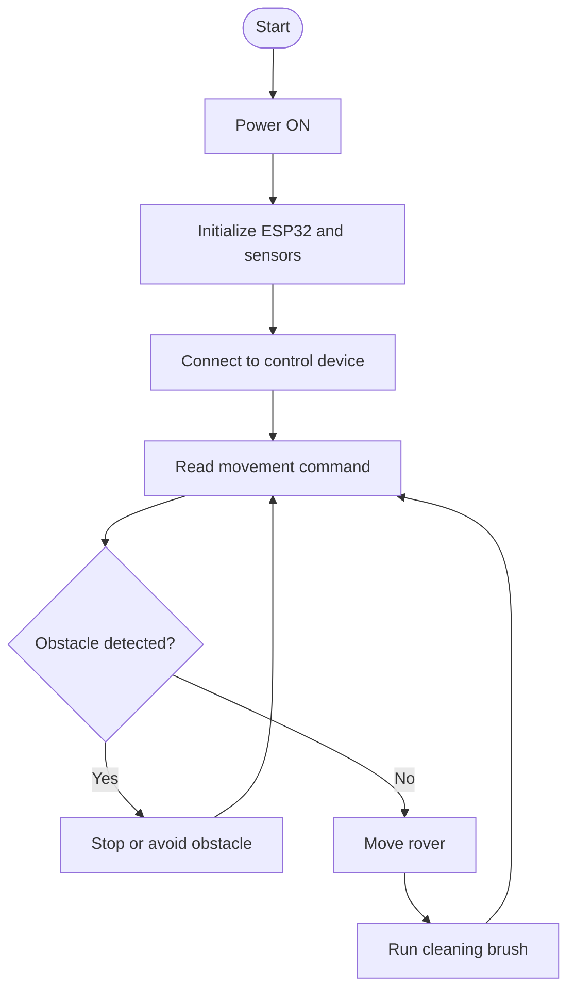

# Software Flowchart – Smart Road Cleaning Rover

## Working Process

## Explanation

1. The rover is switched ON.
2. The ESP32 initializes the sensors and motor controls.
3. The rover receives a movement command.
4. The ultrasonic sensor checks for obstacles.
5. If an obstacle is detected, the rover stops or avoids it.
6. Otherwise, the rover moves and the cleaning brush collects waste.
7. The process repeats while the rover is operating.

*Note: This is a proposed flow. The final process depends on the actual sensors and control method used.*
